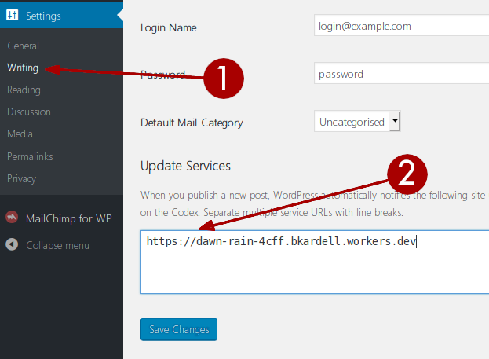

Teaching WordPress to tell the Internet Archive to save new posts

### Adding this service to WordPress's Update Services
1. In the WordPress admin dashboard, under **Settings** in the menu, choose **Writing**
2. In the **Update Services** box, add `https://dawn-rain-4cff.bkardell.workers.dev` on a new line. (If there's already a URL in there, you can add this one on a new line below it.)
3. That's it.

Now every time you make a new WordPress post, WordPress will automatically notify this service, which will
automatically notify the Internet Archive, which will automatically add your post to its list of pages
to be archived and saved.
